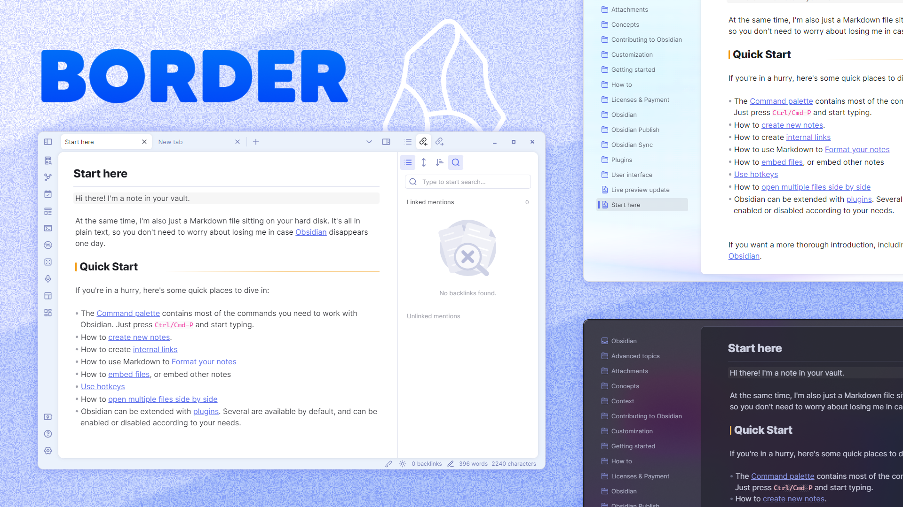
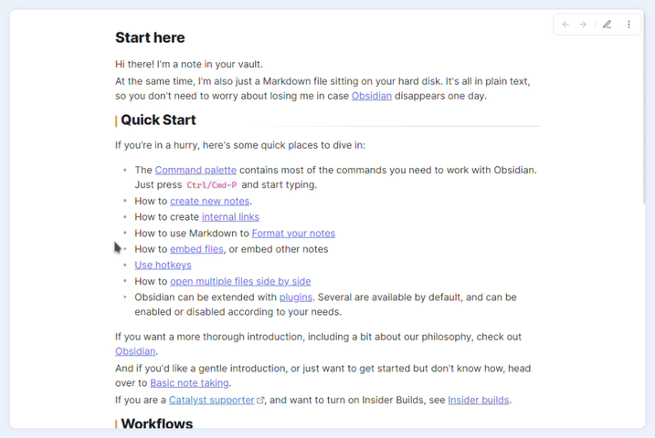
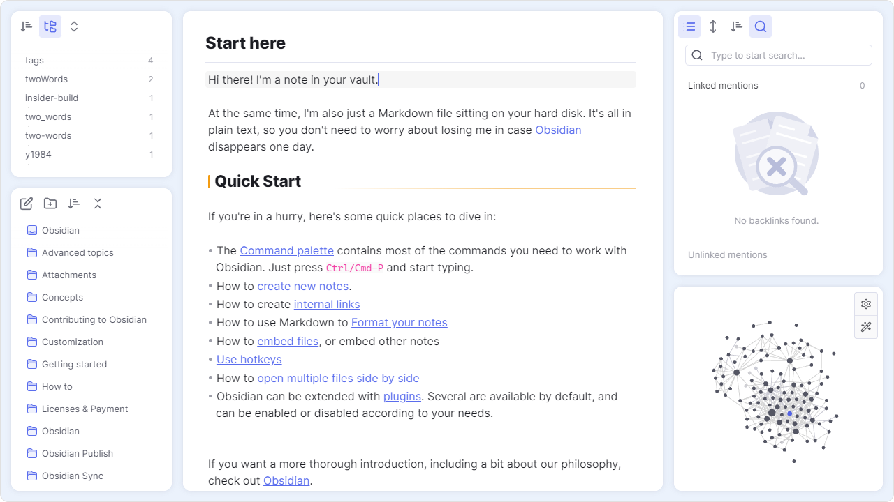
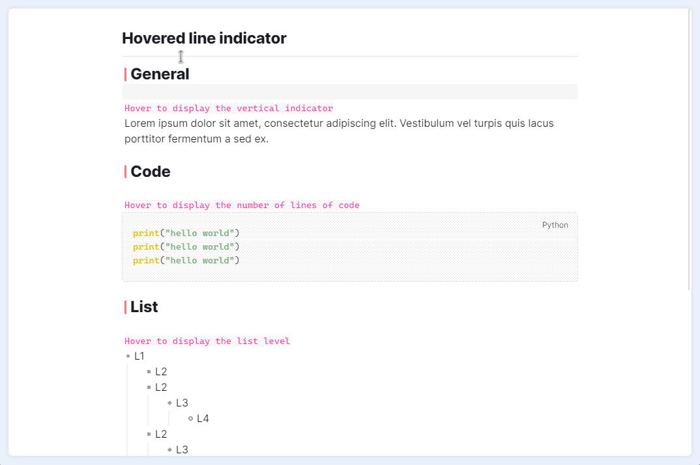
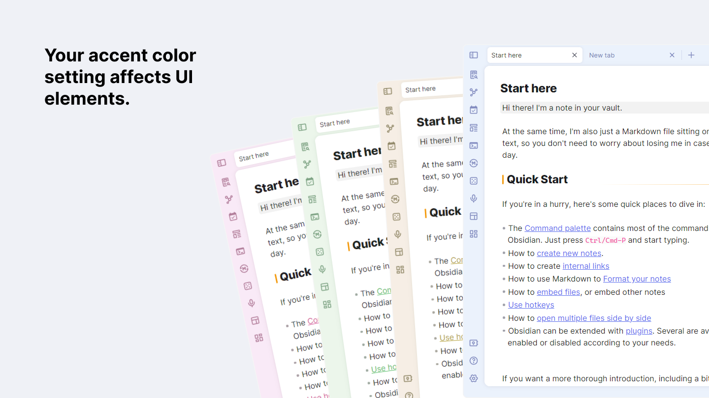

# Obsidian Border Minimal

A minimal and highly customisable theme for Obsidian.

## Feature

> I highly recommended installing the [style settings](https://github.com/mgmeyers/obsidian-style-settings) plugin to customize the theme.

### Auto hide

### Card layout

### Hover line indicator

### Highly customizable

---

Customize the theme in the [style settings](https://github.com/mgmeyers/obsidian-style-settings) plugin.